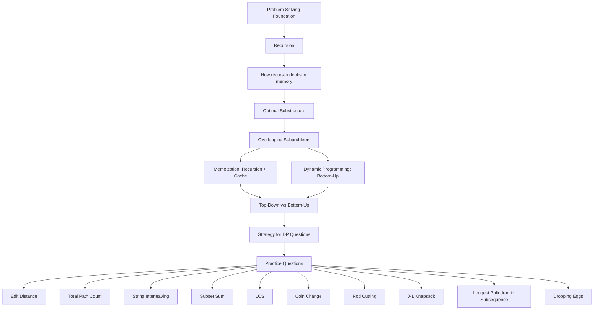
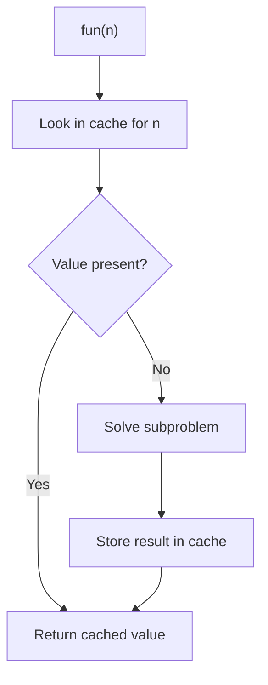

# Dynamic Programming for Coding Interviews — C++ Cheat Sheet

Source used: `Dynamic Programming for Coding Interviews: A Bottom-Up Approach to Problem Solving`

- Preface
- Acknowledgments
- How to Read this Book
- 1. Recursion
- 2. How it Looks in Memory
- 3. Optimal Substructure
- 4. Overlapping Subproblems
- 5. Memoization
- 6. Dynamic Programming
- 7. Top-Down v/s Bottom-Up
- 8. Strategy for DP Question
- 9. Practice Questions

---

## Diagram from the PDF Flow



---

## Preface

- Dynamic Programming \(DP\) problems usually do not require complex data structures.
- They require the right strategy and a mathematical approach.
- A DP solution is first visualized mentally before becoming an algorithm.
- Recursion helps visualize DP because it exposes the subproblem structure.
- Plain recursion is often correct but may be exponential because the same subproblems are solved repeatedly.
- DP is a bottom-up approach where each subproblem is solved once.
- The book uses C code, but the ideas translate directly to C++.

---

## Acknowledgments

- Non-technical front-matter section.
- No algorithmic content.

---

## How to Read this Book

Book-recommended order:

- If short on time and already strong in DP: read Chapters 8 and 9.
- If good at programming but not DP: read Chapters 3, 4, 5, 6, 7.
- If learning DP from scratch: read the full book.
- If more than one week is available:
  - DP champion: Chapters 2, 7, 8, 9.
  - Student/researcher: complete book.

---

# 1. Recursion

## Core Idea

Recursion solves a larger problem in terms of smaller instances of the same problem.

Every recursive solution needs:

1. A terminating condition.
2. A way to reduce the problem size.
3. Work done by the current call.
4. Delegation of the remaining work to recursive calls.

## Sum of First `n` Positive Integers

Recursive definition:

- `sum(n) = n + sum(n - 1)` for `n > 1`
- `sum(1) = 1`

C++:

```cpp
int sum(int n) {
    if (n == 0) return 0;
    if (n == 1) return 1;
    return n + sum(n - 1);
}
```

Iterative version:

```cpp
int sumIterative(int n) {
    int total = 0;
    for (int i = 1; i <= n; ++i) total += i;
    return total;
}
```

Rule from the book:

- Prefer simple, clear code over compact obfuscated code unless performance or memory is improved.
- Never skip terminating conditions.

## Question 1.1 — Factorial

Recursive definition:

- `fact(n) = n * fact(n - 1)` for `n > 1`
- `fact(1) = 1`

C++:

```cpp
long long factorial(unsigned int n) {
    if (n == 0 || n == 1) return 1;
    return n * factorial(n - 1);
}
```

## Question 1.2 — Prefix Sum Array Recursively

Given:

- Input: `1 2 3 4 5 6`
- Output: `1 3 6 10 15 21`

C++:

```cpp
void prefixSum(vector<int>& arr, int index = 1) {
    if (index == static_cast<int>(arr.size())) return;
    arr[index] += arr[index - 1];
    prefixSum(arr, index + 1);
}
```

## Power Function

Recursive definition:

- `x^n = x * x^(n - 1)` for `n > 0`
- `x^0 = 1`

C++:

```cpp
long long power(long long x, int n) {
    if (n == 0) return 1;
    if (n == 1) return x;
    return x * power(x, n - 1);
}
```

## Four Priorities While Writing a Function

1. It must serve the purpose for every valid parameter.
2. Execution time should be minimized.
3. Extra memory should be minimized.
4. Code should be easy to understand.

If recursive and iterative solutions are equally easy and take almost equal time, prefer iterative because recursion costs more memory.

## Tower of Hanoi

Rules:

- Move one disc at a time.
- Never place a larger disc on a smaller disc.

Recursive plan for `n` discs:

1. Move `n - 1` discs from source to extra using destination.
2. Move disc `n` from source to destination.
3. Move `n - 1` discs from extra to destination using source.

C++:

```cpp
void towerOfHanoi(char source, char destination, char extra, int n) {
    if (n <= 0) return;
    towerOfHanoi(source, extra, destination, n - 1);
    cout << "Move Disk-" << n << " FROM " << source << " TO " << destination << '\n';
    towerOfHanoi(extra, destination, source, n - 1);
}
```

## Head Recursion and Tail Recursion

- Head recursion: recursive call happens before the current function performs its main work.
- Tail recursion: recursive call happens at the end, after the current work.

Linked list traversal:

```cpp
struct Node {
    int data;
    Node* next;
};

void printReverse(Node* head) {
    if (!head) return;
    printReverse(head->next);
    cout << head->data << ' ';
}

void printForward(Node* head) {
    if (!head) return;
    cout << head->data << ' ';
    printForward(head->next);
}
```

## Binary Tree Traversal

The book’s picture labels the traversal as preorder, but the code shown is in-order.

C++ in-order:

```cpp
struct TreeNode {
    int data;
    TreeNode* left;
    TreeNode* right;
};

void inOrder(TreeNode* root) {
    if (!root) return;
    inOrder(root->left);
    cout << root->data << ' ';
    inOrder(root->right);
}
```

Optimized null checks:

```cpp
void inOrderOptimized(TreeNode* root) {
    if (!root) return;
    if (root->left) inOrderOptimized(root->left);
    cout << root->data << ' ';
    if (root->right) inOrderOptimized(root->right);
}
```

## Solving Problems Using Recursion

Approach:

1. Define the larger problem.
2. Define smaller same-type subproblems.
3. Solve the base case.
4. Add terminating conditions.

## Recursive Bubble Sort

C++:

```cpp
void bubbleSortRecursive(vector<int>& arr, int n) {
    if (n <= 1) return;

    for (int j = 0; j < n - 1; ++j) {
        if (arr[j] > arr[j + 1]) swap(arr[j], arr[j + 1]);
    }

    bubbleSortRecursive(arr, n - 1);
}
```

## Question 1.1 — Print Multiplication Table Recursively

```cpp
void printTable(int n, int i = 1) {
    if (i > 10) return;
    cout << n << " * " << i << " = " << n * i << '\n';
    printTable(n, i + 1);
}
```

---

# 2. How it Looks in Memory

## C/C++ Program Memory Layout

Main segments:

- Code segment: executable instructions.
- Data segment: global and static variables.
- Stack segment: activation records / stack frames.
- Heap segment: dynamic memory.

## Compilation and Loading

Lifecycle:

- Source files and headers are compiled.
- Object files and libraries are linked.
- Executable file is produced.
- When executed, the process is loaded into RAM.

## Code Segment

- Contains compiled machine instructions.
- Usually read-only while executing.
- May be shareable.
- Fixed at load time.

## Data Segment

- Stores global and static variables.
- Allocated before `main()` starts.
- Load-time variables are initialized at load time.
- Internally divided into initialized and uninitialized data.
- Uninitialized global/static variables are zero-initialized.

Example:

```cpp
int total;        // zero-initialized global
static int count; // zero-initialized static
```

## Stack Segment

- Stores activation records of active function calls.
- Each call creates a new activation record.
- Each return pops one activation record.
- Non-static local variables live in the activation record.
- Local variables are not automatically zero-initialized.
- Recursive calls create multiple activation records.

## Heap Segment

- Used for runtime dynamic memory.
- In C++: `new`, `new[]`, containers like `vector`.
- Heap memory has no direct variable name; it is accessed through pointers or objects.
- Losing access to allocated heap memory causes memory leaks.

## Function Call Overhead

When a function is called:

1. Calling function state is saved.
2. Called function activation record is pushed.
3. Instruction pointer moves to called function.
4. Called function executes.

When it returns:

1. Return value is stored.
2. Called activation record is popped.
3. Calling function state is restored.
4. Instruction pointer returns.
5. Return value replaces the call expression.

Takeaway:

- Function calls cost both time and memory.
- Inline expansion can remove call overhead.
- Recursive functions are difficult to expand inline because depth may be unknown.

## Infinite Recursion

Example:

```cpp
void recursiveMainLikeFunction() {
    int x = 0;
    ++x;
    if (x < 5) {
        cout << "Hello\n";
        recursiveMainLikeFunction();
    }
}
```

Each call has its own `x`, so `x` never reaches 5 across calls. This does not print forever; it prints until stack overflow.

## Recursive v/s Non-Recursive Memory

Recursive sum:

- Time: `O(n)`
- Extra memory: `O(n)` activation records.

Iterative sum:

- Time: `O(n)`
- Extra memory: `O(1)`.

Recursive factorial:

```cpp
long long factorialRecursive(int n) {
    if (n == 0 || n == 1) return 1;
    return n * factorialRecursive(n - 1);
}
```

Iterative factorial:

```cpp
long long factorialIterative(int n) {
    long long result = 1;
    for (int i = 2; i <= n; ++i) result *= i;
    return result;
}
```

## Memory Layout as a Problem-Solving Tool

Key conclusions:

1. A function has multiple activation records only if it is recursive.
2. Global and static variables can only be initialized with constants at load time.
3. Load-time variable memory is allocated before any function is called.
4. Load-time variable memory is released only when execution completes.

Invalid idea:

```cpp
// Not allowed in the same spirit as the book's C example:
// static int x = strlen("Hello");
```

Valid split:

```cpp
static int x;          // load-time zero initialization
x = strlen("Hello");   // runtime assignment
```

---

# 3. Optimal Substructure

## Definition

A problem has optimal substructure if the optimal solution of the whole problem can be built from optimal solutions of its smaller subproblems.

## Shortest Path Example

If the shortest path from `A` to `C` passes through `B`, then it must include:

- shortest path from `A` to `B`
- shortest path from `B` to `C`

So shortest path problems demonstrate optimal substructure.

## Longest Path Counterexample

The book shows a four-city graph where the longest path from `A` to `D` and the longest path from `A` to `C` cannot be combined safely because paths may repeat vertices or invalidate the larger solution.

Takeaway:

- Not every optimization problem has optimal substructure.
- Longest path in the shown form is not treated as a DP problem in the book.

## Use of Optimal Substructure in DP

- Writing the recursive formula is the first step toward DP.
- If you cannot write a recursive relation, you are probably not thinking in DP terms.
- DP logic usually comes from recursion.

---

# 4. Overlapping Subproblems

## Definition

Subproblems overlap when the same subproblem is solved multiple times.

## Fibonacci Recursive Solution

```cpp
int fibRecursive(int n) {
    if (n == 1 || n == 2) return 1;
    return fibRecursive(n - 1) + fibRecursive(n - 2);
}
```

Time recurrence:

- `T(n) = T(n - 1) + T(n - 2) + O(1)`
- Exponential time.

Reason:

- `fib(5)` computes `fib(3)` multiple times.
- `fib(20)` leads to many repeated calls.

## Fibonacci Iterative Solution

```cpp
int fibIterative(int n) {
    if (n == 1 || n == 2) return 1;

    int a = 1;
    int b = 1;
    int c = 0;

    for (int i = 3; i <= n; ++i) {
        c = a + b;
        a = b;
        b = c;
    }

    return c;
}
```

## Minimum Cost Train Route

Problem:

- Stations are numbered `0` to `N - 1`.
- Train moves only forward.
- `cost[i][j]` is cost from station `i` to station `j`.
- Find minimum cost from `0` to `N - 1`.

Recursive relation:

- Either go directly from `s` to `d`.
- Or break at each station `i`, then solve `s -> i` and `i -> d`.

C++:

```cpp
int calculateMinCostRecursive(const vector<vector<int>>& cost, int s, int d) {
    if (s == d || s == d - 1) return cost[s][d];

    int minCost = cost[s][d];
    for (int i = s + 1; i < d; ++i) {
        int temp = calculateMinCostRecursive(cost, s, i)
                 + calculateMinCostRecursive(cost, i, d);
        minCost = min(minCost, temp);
    }
    return minCost;
}
```

Takeaway:

- This has optimal substructure.
- It also solves the same station-pair subproblems repeatedly.

## Interview Tip

- A recursive exponential-time answer can be acceptable first in interviews if it is correct and quickly written.
- Then explain that it can be optimized using DP.

## Question 4.1 — Grid Path Count

Given an `N x N` matrix, count ways from top-left to bottom-right moving only right or down.

This is later solved in Chapter 9.

---

# 5. Memoization

## Core Idea

Memoization stores the result of a subproblem the first time it is solved.

Next time the same subproblem appears:

- return cached value
- do not recompute

Formula from the book:

```text
Memoization = Recursion + Cache - Recomputation of overlapping subproblems
```

## Memoization Flow



## Memoized Fibonacci

```cpp
int fibMemo(int n, vector<int>& memo) {
    if (memo[n] != 0) return memo[n];

    if (n == 1 || n == 2) {
        memo[n] = 1;
    } else {
        memo[n] = fibMemo(n - 1, memo) + fibMemo(n - 2, memo);
    }

    return memo[n];
}
```

## Memoized Train Route

```cpp
int calculateMinCostMemo(
    const vector<vector<int>>& cost,
    int s,
    int d,
    vector<vector<int>>& memo
) {
    if (s == d || s == d - 1) return cost[s][d];
    if (memo[s][d] != 0) return memo[s][d];

    int minCost = cost[s][d];
    for (int i = s + 1; i < d; ++i) {
        int temp = calculateMinCostMemo(cost, s, i, memo)
                 + calculateMinCostMemo(cost, i, d, memo);
        minCost = min(minCost, temp);
    }

    memo[s][d] = minCost;
    return memo[s][d];
}
```

## Cache Data Structure

- One changing parameter: use one-dimensional array.
- Two changing parameters: use two-dimensional array.
- More parameters: use higher-dimensional storage or another appropriate cache.

## Limitation

Memoization still uses recursion, so activation records remain.

If no overlapping subproblems exist, memoization behaves almost like plain recursion.

---

# 6. Dynamic Programming

## Definition Used in the Book

Dynamic Programming solves complex problems by breaking them into simpler subproblems, solving each subproblem once, and storing their solutions.

The book uses:

- Memoization: top-down.
- Dynamic Programming: bottom-up.

## Memoization v/s Dynamic Programming

- Both solve each subproblem once.
- Memoization uses recursion and moves top-down.
- DP solves from the smallest/base cases upward.
- DP avoids recursion overhead.

## Bottom-Up Fibonacci with Constant Memory

```cpp
int fibBottomUp(int n) {
    if (n == 1 || n == 2) return 1;

    int a = 1;
    int b = 1;
    int c = 0;

    for (int i = 3; i <= n; ++i) {
        c = a + b;
        a = b;
        b = c;
    }

    return c;
}
```

## Bottom-Up Fibonacci with Array

```cpp
int fibBottomUpArray(int n) {
    vector<int> arr(n + 1);
    arr[1] = 1;
    arr[2] = 1;

    for (int i = 3; i <= n; ++i) {
        arr[i] = arr[i - 1] + arr[i - 2];
    }

    return arr[n];
}
```

Note:

- Array version is DP but less optimized because it stores unnecessary previous terms.

## Bottom-Up Train Route

```cpp
int calculateMinCostBottomUp(const vector<vector<int>>& cost) {
    int n = cost.size();
    vector<int> minCost(n, 0);

    minCost[0] = 0;
    minCost[1] = cost[0][1];

    for (int i = 2; i < n; ++i) {
        minCost[i] = cost[0][i];
        for (int j = 1; j < i; ++j) {
            minCost[i] = min(minCost[i], minCost[j] + cost[j][i]);
        }
    }

    return minCost[n - 1];
}
```

## Longest Even-Length Substring with Equal Half Sum

Problem:

- Given a digit string.
- Find the length of the longest substring whose first-half digit sum equals second-half digit sum.

Brute force:

- Try all even-length substrings.
- Compute left and right sums.
- Time: `O(n^3)`.

Brute C++:

```cpp
int maxSubstringLengthBrute(const string& str) {
    int n = str.size();
    int maxLen = 0;

    for (int i = 0; i < n; ++i) {
        for (int j = i + 1; j < n; j += 2) {
            int len = j - i + 1;
            if (maxLen >= len) continue;

            int leftSum = 0;
            int rightSum = 0;
            for (int k = 0; k < len / 2; ++k) {
                leftSum += str[i + k] - '0';
                rightSum += str[i + k + len / 2] - '0';
            }

            if (leftSum == rightSum) maxLen = len;
        }
    }

    return maxLen;
}
```

DP idea:

- Store `sum[i][j]`: sum of digits from index `i` to `j`.
- Build sums bottom-up.
- Time: `O(n^2)`.
- Extra memory: `O(n^2)`.

```cpp
int maxSubstringLengthDP(const string& str) {
    int n = str.size();
    int maxLen = 0;
    vector<vector<int>> sum(n, vector<int>(n, 0));

    for (int i = 0; i < n; ++i) {
        sum[i][i] = str[i] - '0';
    }

    for (int len = 2; len <= n; ++len) {
        for (int i = 0; i <= n - len; ++i) {
            int j = i + len - 1;
            int k = len / 2;
            sum[i][j] = sum[i][j - k] + sum[j - k + 1][j];

            if (len % 2 == 0 &&
                sum[i][j - k] == sum[j - k + 1][j] &&
                len > maxLen) {
                maxLen = len;
            }
        }
    }

    return maxLen;
}
```

## Question 6.1

Solve the equal-half-sum substring problem in `O(n^2)` time and constant extra memory.

---

# 7. Top-Down v/s Bottom-Up

## Top-Down Factorial

```cpp
int factorialTopDown(int n) {
    if (n == 1) return 1;
    return n * factorialTopDown(n - 1);
}
```

## Bottom-Up Factorial

```cpp
int factorialBottomUp(int n) {
    int fact = 1;
    for (int i = 2; i <= n; ++i) fact *= i;
    return fact;
}
```

Top-down:

- Starts with the destination.
- Defines what is needed to reach it.
- Usually intuitive.
- Uses call stack.

Bottom-up:

- Starts with base cases.
- Builds required answers forward.
- Avoids recursion overhead.

## Binary Tree Example: Add Child Sum to Each Node

Problem:

- For every node, add the values of all nodes in its hierarchy to its value.
- Leaf nodes remain unchanged.
- Traverse in postorder because children must be solved first.

C++:

```cpp
void addChildSum(TreeNode* root) {
    if (!root) return;

    addChildSum(root->left);
    addChildSum(root->right);

    int finalSum = root->data;
    if (root->left) finalSum += root->left->data;
    if (root->right) finalSum += root->right->data;
    root->data = finalSum;
}
```

Even if the algorithm is written top-down, data flow may be bottom-up.

## Interview Tip

- Recursion is top-down.
- Memoization is also top-down, but caches subproblem answers.
- Dynamic Programming solves bottom-up and avoids recursion.
- Bottom-up is not always better, but in most discussed cases it is.

## Negatives of Bottom-Up DP

Bottom-up DP may solve subproblems that are not needed.

Example: combinations:

- `C(n, m) = C(n - 1, m) + C(n - 1, m - 1)`

Recursive C++:

```cpp
int combination(int n, int m) {
    if (n == 0 || m == 0 || n == m) return 1;
    return combination(n - 1, m) + combination(n - 1, m - 1);
}
```

The DP Pascal triangle builds the whole triangle, but recursion can compute only required nodes for some inputs.

---

# 8. Strategy for DP Question

## High-Level Strategy

1. Try solving using recursion.
2. If subproblems overlap, use memoization or DP.
3. Prefer bottom-up DP for final optimized interview solution when possible.

## Solve it Using Recursion — Minimum Path Cost

Problem:

- Given cost matrix.
- Move only down or right.
- Find minimum cost path from top-left to bottom-right.

Recursive formula:

- Cost to reach `(m, n)` = `cost[m][n] + min(cost to reach (m - 1, n), cost to reach (m, n - 1))`.

C++:

```cpp
int minPathCostRecursive(const vector<vector<int>>& cost, int m, int n) {
    if (m == 0 && n == 0) return cost[0][0];
    if (m == 0) return minPathCostRecursive(cost, m, n - 1) + cost[0][n];
    if (n == 0) return minPathCostRecursive(cost, m - 1, n) + cost[m][0];

    int x = minPathCostRecursive(cost, m - 1, n);
    int y = minPathCostRecursive(cost, m, n - 1);
    return min(x, y) + cost[m][n];
}
```

This has optimal substructure and overlapping subproblems.

## Memoized Minimum Path Cost

```cpp
int minPathCostMemo(
    const vector<vector<int>>& cost,
    int m,
    int n,
    vector<vector<int>>& memo
) {
    if (memo[m][n] != 0) return memo[m][n];

    if (m == 0 && n == 0) memo[m][n] = cost[0][0];
    else if (m == 0) memo[m][n] = minPathCostMemo(cost, m, n - 1, memo) + cost[0][n];
    else if (n == 0) memo[m][n] = minPathCostMemo(cost, m - 1, n, memo) + cost[m][0];
    else {
        int x = minPathCostMemo(cost, m - 1, n, memo);
        int y = minPathCostMemo(cost, m, n - 1, memo);
        memo[m][n] = min(x, y) + cost[m][n];
    }

    return memo[m][n];
}
```

## Bottom-Up Minimum Path Cost

```cpp
int minPathCostDP(const vector<vector<int>>& cost) {
    int m = cost.size();
    int n = cost[0].size();
    vector<vector<int>> dp(m, vector<int>(n, 0));

    dp[0][0] = cost[0][0];

    for (int j = 1; j < n; ++j) dp[0][j] = dp[0][j - 1] + cost[0][j];
    for (int i = 1; i < m; ++i) dp[i][0] = dp[i - 1][0] + cost[i][0];

    for (int i = 1; i < m; ++i) {
        for (int j = 1; j < n; ++j) {
            dp[i][j] = min(dp[i - 1][j], dp[i][j - 1]) + cost[i][j];
        }
    }

    return dp[m - 1][n - 1];
}
```

## Question 8.1

Modify the minimum path cost logic if moves are allowed:

- right
- down
- diagonally lower

## Finding if DP is Applicable

Ask:

1. Can the problem be divided into same-type subproblems?
2. Are the subproblems overlapping?
3. Are we optimizing, maximizing, minimizing, or counting possibilities?

The strongest check:

- optimal substructure
- overlapping subproblems

## Solving DP Problems

Steps:

1. Check if DP is applicable.
2. Define recursion.
   - Define problem in terms of subproblems.
   - Solve base case.
   - Add terminating conditions.
3. Try memoization if subproblems repeat.
4. Try bottom-up DP.

## Example 8.2 — Tile a `2 x n` Plot

Tiles are `2 x 1`, placed horizontally or vertically.

Recursive relation:

- First tile vertical: solve `2 x (n - 1)`.
- First two tiles horizontal: solve `2 x (n - 2)`.

C++:

```cpp
int countWaysToTile2xn(int n) {
    if (n == 0) return 0;
    if (n == 1) return 1;
    if (n == 2) return 2;
    return countWaysToTile2xn(n - 1) + countWaysToTile2xn(n - 2);
}
```

This is Fibonacci-like.

## Question 8.2

If plot becomes `3 x n`, update the logic.

## Example 8.3 — Ways to Reach a Score

Possible moves: score `3`, `5`, or `10`.

Recursive relation:

- `ways(n) = ways(n - 10) + ways(n - 5) + ways(n - 3)`

C++ recursion:

```cpp
int waysToScoreRecursive(int n) {
    if (n < 0) return 0;
    if (n == 0) return 1;
    return waysToScoreRecursive(n - 10)
         + waysToScoreRecursive(n - 5)
         + waysToScoreRecursive(n - 3);
}
```

Bottom-up:

```cpp
int waysToScoreDP(int n) {
    vector<int> arr(n + 1, 0);
    arr[0] = 1;

    for (int i = 1; i <= n; ++i) {
        if (i - 3 >= 0) arr[i] += arr[i - 3];
        if (i - 5 >= 0) arr[i] += arr[i - 5];
        if (i - 10 >= 0) arr[i] += arr[i - 10];
    }

    return arr[n];
}
```

## Question 8.3

Modify if `(10, 3)` and `(3, 10)` are considered the same.

## Example 8.4 — Maximum Sum Contiguous Subarray

Input:

- `{-2, -3, 4, -1, -2, 1, 5, -3}`

Output:

- `7`

## Brute Force

```cpp
int maxSubArraySumBrute(const vector<int>& arr) {
    int n = arr.size();
    int maxSum = INT_MIN;

    for (int i = 0; i < n; ++i) {
        int tempSum = 0;
        for (int j = i; j < n; ++j) {
            tempSum += arr[j];
            maxSum = max(maxSum, tempSum);
        }
    }

    return maxSum;
}
```

## Kadane's Algorithm

```cpp
int kadane(const vector<int>& arr) {
    int maxSumSoFar = 0;
    int maxSumEndingHere = 0;

    for (int x : arr) {
        maxSumEndingHere += x;

        if (maxSumEndingHere < 0) {
            maxSumEndingHere = 0;
        }

        if (maxSumSoFar < maxSumEndingHere) {
            maxSumSoFar = maxSumEndingHere;
        }
    }

    return maxSumSoFar;
}
```

Book discussion:

- Kadane’s algorithm has optimal substructure.
- Its subproblems are not overlapping in the same way as classic DP.
- Whether to call it DP can be discussed in interviews.

---

# 9. Practice Questions

## Edit Distance

Allowed operations:

1. Insert.
2. Remove.
3. Replace.

Goal:

- Minimum operations to convert `str1` into `str2`.

Examples:

- `CAT -> CAR`: edit distance `1`.
- `SUNDAY -> SATURDAY`: edit distance `3`.

### Recursive Solution

```cpp
int editDistanceRecursive(const string& s1, const string& s2, int i, int j) {
    if (i == s1.size()) return s2.size() - j;
    if (j == s2.size()) return s1.size() - i;

    if (s1[i] == s2[j]) {
        return editDistanceRecursive(s1, s2, i + 1, j + 1);
    }

    int removeOp = editDistanceRecursive(s1, s2, i + 1, j);
    int replaceOp = editDistanceRecursive(s1, s2, i + 1, j + 1);
    int insertOp = editDistanceRecursive(s1, s2, i, j + 1);

    return 1 + min({removeOp, replaceOp, insertOp});
}
```

### DP Solution

```cpp
int editDistanceDP(const string& s1, const string& s2) {
    int m = s1.size();
    int n = s2.size();
    vector<vector<int>> dp(m + 1, vector<int>(n + 1, 0));

    for (int j = 0; j <= n; ++j) dp[0][j] = j;
    for (int i = 0; i <= m; ++i) dp[i][0] = i;

    for (int i = 1; i <= m; ++i) {
        for (int j = 1; j <= n; ++j) {
            if (s1[i - 1] == s2[j - 1]) {
                dp[i][j] = dp[i - 1][j - 1];
            } else {
                dp[i][j] = 1 + min({dp[i][j - 1], dp[i - 1][j], dp[i - 1][j - 1]});
            }
        }
    }

    return dp[m][n];
}
```

Time and memory:

- `O(mn)`.

---

## Total Path Count

Problem:

- Count paths from top-left to bottom-right.
- Moves allowed: right and down.

### Recursive Solution

```cpp
int numberOfPathsRecursive(int m, int n) {
    if (m == 0 && n == 0) return 0;
    if (m == 0 || n == 0) return 1;
    return numberOfPathsRecursive(m - 1, n) + numberOfPathsRecursive(m, n - 1);
}
```

### DP Solution

```cpp
int numberOfPathsDP(int m, int n) {
    vector<vector<int>> cache(m, vector<int>(n, 0));

    for (int i = 0; i < m; ++i) cache[i][0] = 1;
    for (int j = 0; j < n; ++j) cache[0][j] = 1;

    for (int i = 1; i < m; ++i) {
        for (int j = 1; j < n; ++j) {
            cache[i][j] = cache[i - 1][j] + cache[i][j - 1];
        }
    }

    return cache[m - 1][n - 1];
}
```

### Questions 9.1 to 9.4

- Count routes on a 2D grid from origin to `(x, y)` moving forward/upward.
- Modify for blocked routes.
- Modify if diagonal movement is allowed.
- Minimum Chess Moves Problem:
  - Knight moves.
  - King moves.
  - Special piece `P` can move like either knight or king.
  - Find minimum moves from source to destination.

---

## String Interleaving

String `C` is an interleaving of `A` and `B` if:

- It contains all characters of `A` and `B`.
- Relative order of characters in both strings is preserved.

First check:

- `C.length() == A.length() + B.length()`

### Recursive Solution

```cpp
bool isInterleavingRecursive(const string& A, const string& B, const string& C, int i, int j, int k) {
    if (i == A.size() && j == B.size() && k == C.size()) return true;
    if (k == C.size()) return false;

    bool first = false;
    bool second = false;

    if (i < A.size() && A[i] == C[k]) {
        first = isInterleavingRecursive(A, B, C, i + 1, j, k + 1);
    }

    if (j < B.size() && B[j] == C[k]) {
        second = isInterleavingRecursive(A, B, C, i, j + 1, k + 1);
    }

    return first || second;
}
```

### DP Solution

```cpp
bool isInterleavedDP(const string& A, const string& B, const string& C) {
    int m = A.size();
    int n = B.size();

    if (C.size() != m + n) return false;

    vector<vector<bool>> mat(m + 1, vector<bool>(n + 1, false));
    mat[0][0] = true;

    for (int i = 1; i <= m; ++i) {
        mat[i][0] = mat[i - 1][0] && A[i - 1] == C[i - 1];
    }

    for (int j = 1; j <= n; ++j) {
        mat[0][j] = mat[0][j - 1] && B[j - 1] == C[j - 1];
    }

    for (int i = 1; i <= m; ++i) {
        for (int j = 1; j <= n; ++j) {
            char current = C[i + j - 1];
            if (A[i - 1] == current && B[j - 1] != current) {
                mat[i][j] = mat[i - 1][j];
            } else if (A[i - 1] != current && B[j - 1] == current) {
                mat[i][j] = mat[i][j - 1];
            } else if (A[i - 1] == current && B[j - 1] == current) {
                mat[i][j] = mat[i - 1][j] || mat[i][j - 1];
            } else {
                mat[i][j] = false;
            }
        }
    }

    return mat[m][n];
}
```

### Questions 9.5 and 9.6

- Print all interleavings of two strings.
- If all characters in `A` are different from all characters in `B`, determine whether two-dimensional matrix storage is still needed and improve memory.

---

## Subset Sum

Problem:

- Given non-negative integers and target `X`.
- Determine whether a subset sums to `X`.

Example:

- Array `{3, 2, 7, 1}`, `X = 6`
- Output: true because `{3, 2, 1}` sums to `6`.

### Recursive Solution

```cpp
bool isSubsetSumRecursive(const vector<int>& arr, int index, int x) {
    if (x == 0) return true;
    if (index == arr.size()) return false;

    if (arr[index] > x) {
        return isSubsetSumRecursive(arr, index + 1, x);
    }

    return isSubsetSumRecursive(arr, index + 1, x) ||
           isSubsetSumRecursive(arr, index + 1, x - arr[index]);
}
```

### DP Solution

```cpp
bool isSubsetSumDP(const vector<int>& arr, int x) {
    int n = arr.size();
    vector<vector<bool>> mat(x + 1, vector<bool>(n + 1, false));

    for (int j = 0; j <= n; ++j) mat[0][j] = true;
    for (int i = 1; i <= x; ++i) mat[i][0] = false;

    for (int i = 1; i <= x; ++i) {
        for (int j = 1; j <= n; ++j) {
            mat[i][j] = mat[i][j - 1];
            if (i >= arr[j - 1]) {
                mat[i][j] = mat[i][j] || mat[i - arr[j - 1]][j - 1];
            }
        }
    }

    return mat[x][n];
}
```

### Questions 9.7 and 9.8

- Two-sum with no more than `O(n log n)` time and constant extra memory in worst case; decide whether DP is needed.
- Print the subset if it exists; otherwise print nothing and return false.

---

## Longest Common Subsequence \(LCS\)

A subsequence preserves order but need not be contiguous.

LCS:

- Longest subsequence common to two strings.

### Recursive Logic

If last characters match:

- `LCS(X, Y, m, n) = 1 + LCS(X, Y, m - 1, n - 1)`

Else:

- `max(LCS(X, Y, m, n - 1), LCS(X, Y, m - 1, n))`

```cpp
int lcsRecursive(const string& x, const string& y, int m, int n) {
    if (m == 0 || n == 0) return 0;

    if (x[m - 1] == y[n - 1]) {
        return 1 + lcsRecursive(x, y, m - 1, n - 1);
    }

    return max(lcsRecursive(x, y, m, n - 1),
               lcsRecursive(x, y, m - 1, n));
}
```

### Memoization

```cpp
int lcsMemo(const string& x, const string& y, int m, int n, vector<vector<int>>& table) {
    if (m == 0 || n == 0) return 0;
    if (table[m][n] != -1) return table[m][n];

    if (x[m - 1] == y[n - 1]) {
        table[m][n] = 1 + lcsMemo(x, y, m - 1, n - 1, table);
    } else {
        table[m][n] = max(lcsMemo(x, y, m, n - 1, table),
                          lcsMemo(x, y, m - 1, n, table));
    }

    return table[m][n];
}
```

### DP Solution

```cpp
int lcsDP(const string& a, const string& b) {
    int m = a.size();
    int n = b.size();
    vector<vector<int>> dp(m + 1, vector<int>(n + 1, 0));

    for (int i = 1; i <= m; ++i) {
        for (int j = 1; j <= n; ++j) {
            if (a[i - 1] == b[j - 1]) {
                dp[i][j] = dp[i - 1][j - 1] + 1;
            } else {
                dp[i][j] = max(dp[i - 1][j], dp[i][j - 1]);
            }
        }
    }

    return dp[m][n];
}
```

### Print LCS

```cpp
string printLCS(const string& a, const string& b) {
    int m = a.size();
    int n = b.size();
    vector<vector<int>> dp(m + 1, vector<int>(n + 1, 0));

    for (int i = 1; i <= m; ++i) {
        for (int j = 1; j <= n; ++j) {
            if (a[i - 1] == b[j - 1]) dp[i][j] = dp[i - 1][j - 1] + 1;
            else dp[i][j] = max(dp[i - 1][j], dp[i][j - 1]);
        }
    }

    string lcs;
    int i = m;
    int j = n;

    while (i > 0 && j > 0) {
        if (a[i - 1] == b[j - 1]) {
            lcs.push_back(a[i - 1]);
            --i;
            --j;
        } else if (dp[i - 1][j] > dp[i][j - 1]) {
            --i;
        } else {
            --j;
        }
    }

    reverse(lcs.begin(), lcs.end());
    return lcs;
}
```

### Questions 9.9 to 9.12

- Longest monotonically increasing subsequence length.
- Print longest monotonically increasing subsequence.
- Longest bitonic subsequence length.
- Print longest bitonic subsequence.

---

## Coin Change Problem

Problem:

- Infinite supply of coins.
- Find minimum number of coins to make sum `S`.

The greedy strategy of choosing the maximum denomination may work for some denominations but fails in general.

### Recursive Solution

```cpp
int minCoinsRecursive(const vector<int>& coins, int s) {
    if (s == 0) return 0;

    int result = INT_MAX;
    for (int coin : coins) {
        if (coin <= s) {
            int temp = minCoinsRecursive(coins, s - coin);
            if (temp != INT_MAX && temp + 1 < result) {
                result = temp + 1;
            }
        }
    }

    return result;
}
```

### DP Solution

```cpp
int minCoinsDP(const vector<int>& coins, int s) {
    vector<int> result(s + 1, INT_MAX);
    result[0] = 0;

    for (int i = 1; i <= s; ++i) {
        for (int coin : coins) {
            if (coin <= i && result[i - coin] != INT_MAX) {
                result[i] = min(result[i], result[i - coin] + 1);
            }
        }
    }

    return result[s];
}
```

### Question 9.13

Find total number of ways to make change using given coin denominations.

---

## Cutting a Rod

Problem:

- Given rod length and market prices for each length.
- Cut rod to maximize profit.

### Recursive Solution

```cpp
int cutRodRecursive(const vector<int>& value, int n) {
    if (n <= 0) return 0;

    int maxValue = INT_MIN;
    for (int i = 1; i <= n; ++i) {
        maxValue = max(maxValue, value[i] + cutRodRecursive(value, n - i));
    }

    return maxValue;
}
```

### Memoized Solution

```cpp
int cutRodMemo(const vector<int>& value, int n, vector<int>& maxValues) {
    if (n <= 0) return 0;
    if (maxValues[n] != 0) return maxValues[n];

    maxValues[n] = INT_MIN;
    for (int i = 1; i <= n; ++i) {
        maxValues[n] = max(maxValues[n], value[i] + cutRodMemo(value, n - i, maxValues));
    }

    return maxValues[n];
}
```

### DP Solution

```cpp
int cutRodDP(const vector<int>& value, int n) {
    vector<int> maxValues(n + 1, 0);

    for (int i = 1; i <= n; ++i) {
        maxValues[i] = INT_MIN;
        for (int j = 1; j <= i; ++j) {
            maxValues[i] = max(maxValues[i], value[j] + maxValues[i - j]);
        }
    }

    return maxValues[n];
}
```

---

## 0-1 Knapsack Problem

Problem:

- Each item has weight and value.
- Each item is either picked completely or not picked.
- Maximize value under capacity `C`.

### Recursive Solution

```cpp
int knapsackRecursive(int capacity, const vector<int>& weight, const vector<int>& value, int n) {
    if (n <= 0 || capacity <= 0) return 0;

    if (weight[n - 1] > capacity) {
        return knapsackRecursive(capacity, weight, value, n - 1);
    }

    int included = value[n - 1] +
                   knapsackRecursive(capacity - weight[n - 1], weight, value, n - 1);

    int excluded = knapsackRecursive(capacity, weight, value, n - 1);

    return max(included, excluded);
}
```

### DP Solution

```cpp
int knapsackDP(int capacity, const vector<int>& weight, const vector<int>& value) {
    int n = weight.size();
    vector<vector<int>> table(n + 1, vector<int>(capacity + 1, 0));

    for (int i = 1; i <= n; ++i) {
        for (int cp = 1; cp <= capacity; ++cp) {
            if (weight[i - 1] <= cp) {
                int remaining = cp - weight[i - 1];
                table[i][cp] = max(value[i - 1] + table[i - 1][remaining],
                                   table[i - 1][cp]);
            } else {
                table[i][cp] = table[i - 1][cp];
            }
        }
    }

    return table[n][capacity];
}
```

### Question 9.14

Modify the solution to also print the items picked.

---

## Longest Palindromic Subsequence

Problem:

- Find length of the longest subsequence that is also a palindrome.

### Recursive Solution

```cpp
int lpsRecursive(const string& str, int start, int end) {
    if (start > end) return 0;
    if (start == end) return 1;

    if (str[start] == str[end]) {
        return lpsRecursive(str, start + 1, end - 1) + 2;
    }

    return max(lpsRecursive(str, start, end - 1),
               lpsRecursive(str, start + 1, end));
}
```

### DP Solution

```cpp
int lpsDP(const string& str) {
    if (str.empty()) return 0;

    int n = str.size();
    vector<vector<int>> table(n, vector<int>(n, 0));

    for (int i = 0; i < n; ++i) table[i][i] = 1;

    for (int len = 2; len <= n; ++len) {
        for (int i = 0; i <= n - len; ++i) {
            int j = i + len - 1;

            if (str[i] == str[j] && len == 2) {
                table[i][j] = 2;
            } else if (str[i] == str[j]) {
                table[i][j] = table[i + 1][j - 1] + 2;
            } else {
                table[i][j] = max(table[i][j - 1], table[i + 1][j]);
            }
        }
    }

    return table[0][n - 1];
}
```

### Question 9.15

Modify the DP to print the longest palindromic subsequence.

---

## Dropping Eggs Puzzle

Problem:

- Find the highest floor from which an egg can be dropped without breaking.
- Minimize worst-case number of drops.

## Two Eggs and 100 Floors — Discussed Approaches

### Linear Solution

- Start from first floor.
- Move one floor up each time.
- Worst case: 100 drops.

### Absolute Binary Solution

- Drop first egg from 50th floor.
- If it breaks, linearly search 1 to 49.
- If not, drop from 75th floor.
- Worst case: 50 drops.

### Fixed Interval Approach

- Divide floors into equal intervals.
- First egg jumps by interval size.
- Second egg linearly searches inside the interval.
- For 100 floors, best fixed interval shown in the book gives worst case `19`.

### Variable Interval Approach

Use decreasing intervals:

```text
x + (x - 1) + (x - 2) + ... + 1 >= 100
```

For 100 floors:

- `x = 14`
- Drop first egg from:
  - `14, 27, 39, 50, 60, 69, 77, 84, 90, 95, 99, 100`
- Worst case: 14 drops.

## Dropping Eggs as DP

General problem:

- `numFloors` floors.
- `numEggs` eggs.

If egg breaks at floor `p`:

- Search `p - 1` lower floors with `numEggs - 1`.

If egg does not break:

- Search `numFloors - p` upper floors with `numEggs`.

Recursive C++:

```cpp
int dropEggs(int floors, int eggs) {
    if (floors == 0 || floors == 1 || eggs == 1) return floors;

    int best = INT_MAX;

    for (int p = 1; p <= floors; ++p) {
        int worst = max(dropEggs(p - 1, eggs - 1),
                        dropEggs(floors - p, eggs));
        best = min(best, worst);
    }

    return best + 1;
}
```

This has:

- optimal substructure
- overlapping subproblems

So it is fit for DP.

---

## Final DP Pattern Summary

Use this checklist:

1. Write the recursive relation.
2. Identify base cases.
3. Check whether subproblems repeat.
4. Choose cache dimensions from changing parameters.
5. Convert top-down recursion to bottom-up order.
6. Store only necessary previous values when possible.
7. Explain time and memory trade-offs clearly in interviews.

